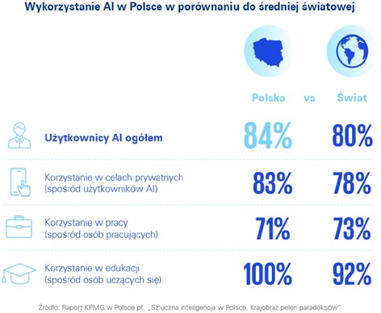

# Wprowadzenie 

## Pakiety których będę używać:

```{r, message=FALSE, warning=FALSE}

library(knitr)
library(dplyr)
library(ggplot2)
library(psych)
library(mice)
library(corrplot)
library(ggthemes)
```

## Opis

W obecnych czasach rośnie zainteresowanie sztuczną inteligencją, a narzędzia wspierane przez Artificial Intelligence towarzyszą nam niemal na każdym kroku. 

Rozwój tej technologii budzi wiele kontrowersji m.in. etyczne, prawne i edukacyjne. 
Często wynika to z faktu niewystarczającej (lub braku) regulacji użytkowania AI lub świadomości użytkowników.

Większość źródeł internetowych w Polsce cytuje analizy przeprowadzonych badań przez KPMG. Badania te pokazują ciekawe statystyki, w których aż 84% badanych Polaków przyznaje się do używania narzędzi AI. 
Dodatkowo wśród ankietowanych każdy uczeń przyznał, że używa ich do celów edukacyjnych.
Dane te potwierdzają, że technologia ta odgrywa coraz większą rolę w naszym życiu, także w procesie kształcenia.

```{r, fig.align="center"}



```

Niniejsza EDA dotyczy używania narzędzi AI przez studentów w celach edukacyjnych. Ze względu na ograniczoną dostępność szczegółowych danych dot. studentów w Polsce, w projekcie wykorzystuję zbiór danych odnoszący się do studentów z Indii. Różnice kulturowe, systemowe oraz edukacyjne mogą wpływać na sposób korzystania z narzędzi sztucznej inteligencji, dlatego ta analiza nie powinna stanowić odniesienia dla ogółu studentów z Polski czy ze świata.


## O zestawie danych

Wybrałam zestaw danych umieszczonych na platformie *<https://www.kaggle.com>* o nazwie **AI Tool Usage by Indian College Students 2025** opracowany przez **Rakesh Kapilavayi**.
Dane powstały na podstawie przeprowadzonych ankiet wśród studentów z różnych uczelni na terenie Indii. Plik zawiera 16 zmiennych (jakościowych i ilościowych) i 3614 obserwacji. 

## Zmienne

* **Student_Name**  <span style="color: lightblue;">*Imię studenta zmienione na potrzeby publikacji*</span>
* **College_Name**  <span style="color: lightblue;">*Nazwa uczelni*</span>
* **Stream**  <span style="color: lightblue;">*Dziedzina/Rodzaj studiów (np. Inżynieria, Artystyczne)*</span>
* **Year_of_Study**   <span style="color: lightblue;">*Rok studiów (1-4)*</span>
* **AI_Tools_Used**   <span style="color: lightblue;">*Użyte narzędzie AI*</span>
* **Daily_Usage_Hours**   <span style="color: lightblue;">*Dzienny czas użycia narzędzi AI w godzinach*</span>
* **Use_Cases**   <span style="color: lightblue;">*Powody użycia sztucznej inteligencji*</span>
* **Trust_in_AI_Tools**   <span style="color: lightblue;">*Zaufanie do AI w skali 1-5*</span>
* **Impact_on_Grades**    <span style="color: lightblue;">*Wpływ na oceny - zakres od -5 do +5*</span>
* **Do_Professors_Allow_Use**   <span style="color: lightblue;">*Czy jest przyzwolenie wykładowcy? (Tak/Nie)*</span>
* **Preferred_AI_Tool**   <span style="color: lightblue;">*Preferowane narzędzie AI*</span>
* **Awareness_Level**   <span style="color: lightblue;">*Poziom świadomości na temat AI w skali 1–10*</span>
* **Willing_to_Pay_for_Access**   <span style="color: lightblue;">*Chęć/gotowość do  płacenia za dostęp (Tak/Nie)*</span>
* **State**   <span style="color: lightblue;">*Stan w Indiach*</span>
* **Device_Used**   <span style="color: lightblue;">*Używane urządzenie (np. Laptop, Smartfon)*</span>
* **Internet_Access**   <span style="color: lightblue;">*Jakość dostępu do internetu (słaba/średnia/wysoka)*</span>

# Przygotowanie danych 

## Wczytanie pliku

```{r}
studenci_AI <- read.csv("students.csv", sep = ",")
```

## Zapoznanie się z danymi

```{r}
head(studenci_AI, 10)
tail(studenci_AI)

```

Powyżej pokazało mi się dziesięć pierwszych i 6 ostatnich wierszy. Jak widać zmienne Use_Cases oraz AI_Tools_Used nie będą łatwe do analizy, ze względu na wielokrotne wartości w komórkach.

## Poznanie struktury

```{r}
str(studenci_AI)

```

W oryginalnym pliku z danymi występują 3 typy zmiennych: character (ciąg znaków/tekst),
numeric (liczby zmiennoprzecinkowe) i integer (liczby całkowite). 

## Poznanie zmiennych i ich rozkładów, zamiana typów {.tabset} 

Teraz czas na poznanie zmiennych. Na potrzeby analizy wiele ze zmiennych zmienię na typ factor. Tym, w których kolejność może mieć znaczenie, nadam kategorie/ poziomy.

### Zmienne liczbowe

Jedna z najciekawszych zmiennych, czyli zaufanie do AI:
```{r}
table(studenci_AI$Trust_in_AI_Tools)
studenci_AI %>%
  ggplot() +
  geom_bar(aes(x = Trust_in_AI_Tools),
                 color = "darkblue", fill = "lightyellow") +
  theme_fivethirtyeight() +
  labs(title = "Zaufanie studentów do AI",
       x = "stopień zaufania", 
       y = "ilość studentów")

```

Jest to ocena, zostawiam ją w postaci liczbowej, co pozwoli mi na liczenie statystyk opisowych, a nie tylko określanie kierunku wpływu. Zaufanie jest dość zróżnicowane.

Poznanie zmiennych Daily_Usage_Hours - dzienny czas używania, Impact_on_Grades - wpływ na oceny oraz Awareness_Level - poziom świadomości:
```{r}
table(studenci_AI$Daily_Usage_Hours)
studenci_AI %>%
  ggplot() +
  geom_boxplot(aes(x = Daily_Usage_Hours),
                 color = "darkblue", fill = "lightyellow") +
  theme_fivethirtyeight() +
  labs(title = "Dzienne użycie narzędzi AI (w godzinach)",
       x = "godziny")
table(studenci_AI$Impact_on_Grades)
table(studenci_AI$Awareness_Level)
```

Brak zmiany typu, tutaj dane liczbowe dają najwięcej możliwości. 
Przy zmiennej dot. czasu używania może zajść potrzeba uproszczenia wartości, np. wprowadzenia przedziałów (wartości są z przedziału 0,5 - 5[h], co 0,1 h i o liczebności od 8 do 135 osób przy każdej z wartości). 

  
### Zmienne jakościowe zamienione na typ factor

Teraz poznaję zmienną Stream - dziedzina studiów:

```{r}
table(studenci_AI$Stream)
studenci_AI$Stream <- as.factor(studenci_AI$Stream)
studenci_AI %>%
  ggplot() +
  geom_bar(aes(x = Stream),
           color = "darkblue", fill = "lightyellow") +
  theme_fivethirtyeight() +
  labs(title = "Dziedzina studiów wśród badanych studentów",
       x = "Dziedzina",
       y = "Ilość studentów")
```

Ta zmienna na pewno będzie użyteczna jako typ factor. Kolejność bez znaczenia. Widać wyraźne różnice pomiędzy liczebnością grup, dominują kierunki ścisłe.

Czas na zmienną Year_of_Study:

```{r}
studenci_AI$Year_of_Study <- as.factor(studenci_AI$Year_of_Study)
levels(studenci_AI$Year_of_Study) <- 1:4
pie(table(studenci_AI$Year_of_Study),
    main = "Rok studiów",
    col = rainbow(4))
```

Rok studiów traktuję jako zmienną porządkową, obliczanie statystyk opisowych nie wniosłoby nic do analizy, dlatego postanowiłam zmienić typ na factor i nadać poziomy. Wykres kołowy przedstawia rozkład zmiennej, przeważa rok 2.

Jako następną sprawdzam zmienną AI_Tools_Used.
```{r}
table(studenci_AI$AI_Tools_Used)
studenci_AI$AI_Tools_Used <- as.factor(studenci_AI$AI_Tools_Used)
```

Część rekordów tej zmiennej w zbiorze danych ma wielokrotne wartości, jednak są one dość powtarzalne, dlatego postanowiłam zamienić typ na factor.

Zmienna przyzwolenia profesorów na używanie AI:
```{r}
table(studenci_AI$Do_Professors_Allow_Use)
studenci_AI$Do_Professors_Allow_Use <- as.factor(studenci_AI$Do_Professors_Allow_Use)
pie(table(studenci_AI$Do_Professors_Allow_Use),
    main = "Czy wykładowcy wyrazili zgodę na użycie AI",
    col = c("red", "green"))
```

Zmieniam na factor, bez znaczenia kolejność. Jednym z prostszych wykresów do tego typów danych jest wykres kołowy. Z łatwością można zauważyć przewagę odpowiedzi "Nie".

Poznaję kolejną zmienną: 
```{r}
table(studenci_AI$Preferred_AI_Tool)
studenci_AI$Preferred_AI_Tool <- as.factor(studenci_AI$Preferred_AI_Tool)
```

Preferowane narzędzie AI będzie przydatne, dlatego zmieniam na factor.
Tutaj także kolejność nie ma znaczenia

Chęć do płacenia za narzędzia AI ma strukturę Tak/Nie, więc zmieniam ją na factor
```{r}
studenci_AI$Willing_to_Pay_for_Access <- as.factor(studenci_AI$Willing_to_Pay_for_Access)
```

Poznaję strukturę zmiennej State:
```{r}
table(studenci_AI$State)
studenci_AI$State <- as.factor(studenci_AI$State)
```

Może się okazać pomocna w badaniu wpływu, postanowiłam zamienić jej typ na factor.

Zmienna pokazująca jakie urządzenia wykorzystano do użycia narzędzi sztucznej inteligencji :
```{r}
table(studenci_AI$Device_Used)
studenci_AI$Device_Used <- as.factor(studenci_AI$Device_Used)
studenci_AI %>%
  ggplot(aes(x = Device_Used)) +
  geom_bar(fill = "lightyellow", colour = "darkblue") +
  theme_fivethirtyeight() +
  labs(title = "Urządzenia wykorzystywane do korzystania 
       z narzędzi AI",
       x = "Urządzenie",
       y = "Ilość studentów")

```

Wykres słupkowy przedstawia preferencje studentów dot. używania urządzeń w celu korzystania z narzędzi sztucznej inteligencji. Na wykresie widać stanowczą przewagę używania laptopów.

Jakość dostępu do internetu także zmieniam na typ faktor:
```{r}
table(studenci_AI$Internet_Access)
studenci_AI$Internet_Access <- as.factor(studenci_AI$Internet_Access)
```

### Zmienne identyfikacyjne i tekstowe
Zmienną zawierającą imiona studentów pomijam, ponieważ nie ma znaczenia w mojej EDA.
Kolejną zmienną jest Nazwa uczelni - College_Name, przy próbie poznania struktury okazało się, że rozróżnia bardzo dużo wartości. W mojej EDA nie będę używać tej zmiennej, dlatego nie zmieniam typu. 

```{r}
#table(studenci_AI$College_Name)
```

Sprawdzając powtarzające się dane w kolumnie Use_Cases napotkałam problem z unikalnością danych (ponad 300). Część powodów powtarza się, jednak ze względu na pozmienianą kolejność wpisywania, program rozróżnia je jako inne wartości. Duplikowanie wierszy zaburzyłoby statystykę (m.in. sztucznie zwiększyłoby próbę), a zmiana na typ factor nie wniosłaby nic do statystyki. Dlatego postanowiłam nie ingerować w tę zmienną, a jeżeli w analizie uznam to za zasadne, poszczególne powody użycia AI będę weryfikować za pomocą wyszukiwania frazy tekstowej. (Kod poniżej jest umieszczony jako komentarz ze względów estetycznych- bardzo długa tabela.)

```{r}
#table(studenci_AI$Use_Cases)
```

## Sprawdzanie braków i wartości odstających

W celu sprawdzenia występowania brakujących danych używam funkcji md.pattern() z pakietu **mice**.
```{r}

md.pattern(studenci_AI)

```

Analiza wykazała, że dane nie zawierają braków.

```{r}
summary(studenci_AI)

studenci_AI %>% 
  select(Daily_Usage_Hours, Trust_in_AI_Tools, Impact_on_Grades, Awareness_Level) %>% 
  describe()

```

Funkcja summary() przedstawiła statystyki opisowe i rozkłady poszczególnych zmiennych, w większości danych funkcja nie wskazuje na wartości odstające. 

Funkcja psych:: describe() pokazuje podstawowe statystyki opisowe: średnią, odchylenie standardowe, zakres zmienności, oraz miary skośności i kurtozy. Wybrałam do niej tylko dane liczbowe. W dalszej części przedstawię graficznie rozkłady i zależności wybranych danych.

# Analiza zbioru danych

## Zależności między zmiennymi

Zaczynam od wstępnej analizy zależności między zmiennymi liczbowymi. W tym celu tworzę macierz korelacji Spearmana.

```{r}
cor_studenci <- cor(
  studenci_AI[, c("Daily_Usage_Hours", "Trust_in_AI_Tools",
                  "Impact_on_Grades", "Awareness_Level")],
  method = "spearman")

round(cor_studenci, 2)
corrplot(cor_studenci, method = "square", type = "upper")
```

Po analizie macierzy korelacji można dostrzec brak silnych zależności pomiędzy zmiennymi liczbowymi. Wartości współczynników korelacji są niskie, co sugeruje, że badane zmienne nie są ze sobą silnie powiązane.

## Statystyki i analizy

Najciekawszym zagadnieniem wydaje się zaufanie studentów do AI.

```{r}
table(studenci_AI$Trust_in_AI_Tools)
summary(studenci_AI$Trust_in_AI_Tools)
```

Według powyższych podsumowań najliczniejszą grupą są studenci, którzy deklarują pełne zaufanie do AI.

Warto sprawdzić, czy na zaufanie wpływa rok studiów.

```{r}
studenci_AI %>% group_by(Year_of_Study) %>% count(Trust_in_AI_Tools)

studenci_AI %>% group_by(Year_of_Study) %>%
  summarise( srednie_zaufanie = mean(Trust_in_AI_Tools), 
             mediana_zaufania = median(Trust_in_AI_Tools),
             odchylenie = sd(Trust_in_AI_Tools))

studenci_AI %>% group_by(Year_of_Study) %>%
  summarise(srednie_zaufanie = mean(Trust_in_AI_Tools),
            mediana_zaufanie = median(Trust_in_AI_Tools)) %>%
  ggplot(aes(x = Year_of_Study, y = srednie_zaufanie , group = 1)) + 
  geom_line(aes(y = srednie_zaufanie, colour = "średnia"), colour = "skyblue") + 
  geom_point(size = 2, colour = "darkblue") +
  geom_line(aes(y = mediana_zaufanie, colour = "mediana"), colour = "darkgreen") + 
  theme_fivethirtyeight() +
  labs(title = "Mediana oraz średni poziom zaufania do AI 
       w zależności od roku studiów",
       x = "Rok studiów",
       y = "Poziom zaufania do AI")
  
```

Z podsumowania wynika, że średnia zaufania jest najmniejsza w pierwszym roku studiów, w drugim jest największa, a następnie nieznacznie maleje. Różnice między latami są niewielkie. Mediana na każdym roku studiów pozostaje taka sama. Wyniki nie są zaskakujące, ponieważ można przypuszczać, że wraz z kolejnymi latami studiów rośnie poziom wiedzy, a on powinien wpływać na większą świadomość użytkownika na temat błędów AI. Na podstawie tych danych nie można potwierdzić tej zależności, zaskakujące jest to, że zaufanie maleje bardzo wolno i dopiero od drugiego roku.

Warto też sprawdzić czy i w jakim stopniu wzrost poziomu świadomości użytkownika ma wpływ na zaufanie do AI. 

```{r}
studenci_AI %>%
  select(Awareness_Level, Trust_in_AI_Tools) %>% 
  cor(method = "spearman")
```

Obliczony poziom korelacji pokazuje minimalną zależność pomiędzy powyższymi danymi. Wpływ jest tak mały, że można przyjąć, że sama zmiana poziomu świadomości użytkownika nie wpływa na zaufanie do narzędzi AI.

Sprawdzę, też czy poziom świadomości użytkownika różni się w zależności od roku studiów.

```{r}
studenci_AI %>% group_by(Year_of_Study) %>%
  summarise( srednie_swiadomosci = mean(Awareness_Level), 
             mediana_swiadomosci = median(Awareness_Level),
             odchylenie = sd(Awareness_Level))
```

Również w tym przypadku nie widać wyraźnego trendu wzrostowego wraz z kolejnymi latami studiów. Z podsumowania wynika, że najwyższy poziom świadomości przypada w 2 roku studiów, a później spada. Wyniki sugerują, że rok studiów nie jest czynnikiem silnie różnicującym poziom świadomości studentów na temat AI. 

Do tej pory analiza przypadków nie wykazała znacznego oddziałowywania na siebie badanych zmiennych.

Szukając wpływu na poziom świadomości użytkownika na temat sztucznej inteligencji nie można pominąć także czasu użytkowania narzędzia. Czy czas który studenci poświęcają na użytkowanie modeli AI, ma wpływ na świadomość?

```{r}
studenci_AI %>% group_by(Daily_Usage_Hours) %>%
  summarise( srednia_uzycia = mean(Awareness_Level), 
             mediana_uzycia = median(Awareness_Level),
             odchylenie_uzycia = sd(Awareness_Level)) %>% 
  ggplot(aes(x = Daily_Usage_Hours, y = Awareness_Level , group = 1)) + 
  geom_line(aes(y = srednia_uzycia, colour = "średnia")) + 
  geom_point(aes(y = srednia_uzycia)) +
  geom_line(aes(y = mediana_uzycia, colour = "mediana")) + 
  geom_line(aes(y = odchylenie_uzycia, colour = "odchylenie")) + 
  theme_fivethirtyeight() +
  labs(title = "Dzienny czas korzystania z narzędzi AI 
       a poziomu świadomości",
       x = "Czas korzystania z AI",
       y = "Poziom świadomości")

```

Ze względu na wiele unikalnych wartości i małą liczebność obserwacji, wyniki analizy nie są jednoznaczne. Zasadne byłoby tutaj pogrupować czas użytkowania w przedziały. 


```{r}
studenci_AI_czas <- studenci_AI %>% mutate(
    czas_uzywania = cut(Daily_Usage_Hours,
      breaks = c(0, 1, 2, 3, 4, 5),
      labels = c("≤1 h", "1–2 h", "2–3 h", "3–4 h", "4–5 h"),
      include.lowest = TRUE))

studenci_AI_czas %>% group_by(czas_uzywania) %>%
  summarise( srednia_uzycia = mean(Awareness_Level), 
             mediana_uzycia = median(Awareness_Level),
             odchylenie_uzycia = sd(Awareness_Level)) %>% 
  ggplot(aes(x = czas_uzywania, y = Awareness_Level , group = 1)) + 
  geom_line(aes(y = srednia_uzycia, colour = "średnia")) + 
  geom_point(aes(y = srednia_uzycia)) +
  geom_line(aes(y = mediana_uzycia, colour = "mediana")) + 
  geom_line(aes(y = odchylenie_uzycia, colour = "odchylenie")) + 
  theme_fivethirtyeight() +
  labs(title = "Dzienny czas korzystania z narzędzi AI 
       a poziomu świadomości",
       x = "Czas korzystania z AI",
       y = "Poziom świadomości")

```

Na podstawie tych danych nie widać trendu wskazującego na wzrost poziomu świadomości na temat AI wraz ze wzrostem dziennego użytkowania. 

Czy wyższe zaufanie do AI wiąże się z lepszą oceną jego wpływu na oceny?

```{r}
cor(studenci_AI$Trust_in_AI_Tools, studenci_AI$Impact_on_Grades, method = "spearman")

studenci_AI %>% 
  ggplot(aes(x = Trust_in_AI_Tools, y = Impact_on_Grades)) +
  geom_jitter(alpha = 0.3) +
  theme_fivethirtyeight() +
  labs(title = "Zaufanie do AI a wpływ na oceny",
       x = "Poziom zaufania do AI",
       y = "Wpływ na oceny")

```

Obliczona korelacja pokazuje niewielki ujemny wpływ zaufania na opinie studentów n.t. wpływu AI na oceny.

Sprawdzę teraz, czy rok studiów wpływa na intensywność korzystania z AI.

```{r}
studenci_AI %>%
  group_by(Year_of_Study) %>%
  summarise( srednia_czasu = mean(Daily_Usage_Hours),
             mediana_czasu = median(Daily_Usage_Hours))
```

Najbardziej intensywnym wydaje się być drugi rok studiów. Ankietowani studiujący na tym roku używają narzędzi AI najdłużej.


Przy poznawaniu zmiennych zauważyłam, że w używanych narzędziach AI przeważa ChatGPT. Ma on możliwość wybrania narzędzia, a najpopularniejszy (i domyślny) jest model językowy. Czy najczęściej używany jest przez humanistów? Czy jest zależność między wyborem narzędzia a kierunkiem studiów? 

```{r}
table(studenci_AI$AI_Tools_Used, studenci_AI$Stream)
```

Ograniczam tabelę do wyboru narzędzia ChatGPT
```{r}
wgdziedziny <- studenci_AI %>% count(Stream, name = "total")
uzytkownicy <- studenci_AI %>% filter(grepl("ChatGPT", AI_Tools_Used)) %>% 
      count(Stream, name = "uzytChatGPT") 
uzyt_chatgpt <- left_join(uzytkownicy, wgdziedziny, by = "Stream")

uzyt_chatgpt <- uzyt_chatgpt %>%
  mutate(udzial = uzytChatGPT/total)

```

Wykres użytkowników ChataGPT wg. dziedziny studiów:

```{r}

uzyt_chatgpt %>% 
  ggplot(aes(x = Stream, y = udzial)) +
  geom_col(fill = "lightyellow", colour = "darkblue") +
  theme_fivethirtyeight() + coord_flip() +
  labs(
    title = "Użytkownicy ChatGPT wg dziedziny studiów 
    [odsetek 0-1]",
    x = "Dziedzina studiów",
    y = "Odsetek odpowiedzi")
```

Na wykresie przedstawiłam odsetek odpowiedzi, które zawierały "ChatGPT", w poszczególnych grupach dziedzin studiów. Na jego podstawie można stwierdzić, że to narzędzie jest najpopularniejsze wśród kierunków Inżynieryjnych, a zaraz po tym kierunki Zarządzania/Menadżerskie.

Sprawdzę więc jeszcze, czy jest zależność między kierunkiem studiów a preferowanym narzędziem.

```{r}
studenci_AI %>% 
  ggplot(aes(x = Stream, fill = Preferred_AI_Tool)) +
  geom_bar(position = "fill", colour = "white") +
  theme_fivethirtyeight()+
  coord_flip() +
  labs(
    title = "Najczęściej używane AI wg. dziedziny studiów",
    x = "Dziedzina studiów",
    y = "Ilość odpowiedzi",
    fill = "Narzędzie AI")

```

Nie ma grup, które wyraźnie preferowałyby konkretne narzędzie. Jednak widać duże zróżnicowanie w każdej dziedzinie studiów. Może to wynikać z różnic użyteczności danych narzędzi.

Jak kształtuje się przyzwolenie na używanie narzędzi AI na poszczególnych kierunkach studiów?

```{r}
studenci_AI %>%
  ggplot() +
  geom_bar(aes(x = Stream, fill = Do_Professors_Allow_Use),
           colour = "white", 
           position = "fill") +
  scale_fill_brewer(palette="RdYlGn") +
  theme_fivethirtyeight() +
  coord_flip() +
  labs(title = "Kierunek studiów a przyzwolenie na używanie",
       x = "Kierunek studiów",
       y = "Odsetek odpowiedzi",
       fill = "Czy jest przyzwolenie wykładowcy?")

```

Wyniki są dość zróżnicowane, na większości kierunków przeważa brak przyzwolenia na użycie AI. Największe przyzwolenie mają studenci Hotel-management, Medical oraz Commerce, ale nie jest ono znacząco większe.

Nie ma wyraźnej zależności między kierunkiem studiów, a podejściem wykładowców do kwestii użytkowania AI. 

# Podsumowanie

Celem niniejszej eksploracyjnej analizy danych było poznanie sposobów wykorzystania narzędzi sztucznej inteligencji przez studentów oraz identyfikacja potencjalnych zależności pomiędzy wybranymi cechami, postawami i zachowaniami użytkowników oraz wpływów zewnętrznych. Analiza objęła zarówno zmienne ilościowe, jak i jakościowe, a także ich wzajemne relacje.
Analiza pokazała, że studenci z Indii dość intensywnie używają AI. Nie znalazłam wyraźnych wpływów ani silnych zależności. Powyższa EDA może być początkiem do głębszej interpretacji zachowań studentów w kontekście korzystania z AI. 


# Bibliografia 

Dane ogólne na temat AI w Polsce  
<https://kpmg.com/pl/pl/media/korzysta-z-ai-regularnie-przewaznie-bez-zadnego-przeszkolenia-i-czesto-bez-wiedzy-pracodawcy.html> 

Zestaw danych użytych do analizy  
<https://www.kaggle.com/datasets/rakeshkapilavai/ai-tool-usage-by-indian-college-students-2025> 

Zgłębianie wiedzy na temat Eksploracyjnej Analizy Danych  
<https://pl.wikipedia.org/wiki/Eksploracja_danych>  
<https://pl.wikipedia.org/wiki/Badania_eksploracyjne>  
<https://astrafox.pl/slownik/exploratory-data-analysis-eda/>  

W EDA użyto materiały:

* wykłady oraz przykładowe EDA, autor: dr Jacek Wolak
* wykłady oraz materiały dodatkowe, autor: dr Beata Basiura
* materiały z ćwiczeń, autor: mgr Agnieszka Choczyńska
* darmowe samouczki oraz ebooki
* materiały z kursów na platformie DataCamp